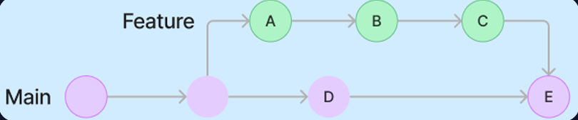
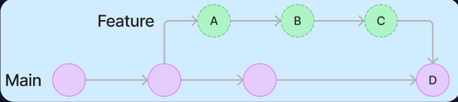

## WIL 2

### Fork
- 다른 사용자의 Repository를 자신의 계정으로 복사하여 
독립적으로 수정하고 관리
- Fork한 Repository에서 수정 후, 원래 Repository에 변경 사항을 병합하도록 요청 가능
- 오픈 소스 소프트웨어 개발에서 자주 사용됨

### Star
- 관심 있는 Repository나 프로젝트에 star를 달아 
“북마크”와 같이 관리

### Issue
-  Repository에서 작업 계획, 토론 및 추적을 위해 활용
1. 작업 추적: 버그, 개선 사항 또는 기타 요청 사항을 추적하는 데 사용
2. 피드백 제공 및 수신: 작업에 대한 피드백을 주거나 받을 수 있음
3. 아이디어 작업 협업: 팀원들과 아이디어나 작업을 협업할 수 있음
4. 효율적인 커뮤니케이션: 팀원들과 아이디어나 작업을 협업할 수 있음

### Branch
- 기존 브랜치에서 분기되어 생성되는 별도의 작업 공간
- fork와 달리 같은 Repository에 생성됨

### Branch Naming Convention
- “type/<issue 번호>-<간략한 설명>"

### Branch 명령어
- 현재 브랜치 확인하기
```
$ git branch
```
- 모든 브랜치 확인하기

```
$ git branch -a
```
- 브랜치 생성하기
```
$ git branch "<브랜치 이름>"
```
- 브랜치 삭제하기
```
$ git branch -D "<브랜치 이름>"
```
- 브랜치 이동하기
```
$ git checkout "<브랜치 이름>"
```
- 브랜치 생성 후 이동하기
```
$ git checkout -b "<브랜치 이름>"
```

### Pull Request
- 분기된 Branch를 다시 병합하기 위한 절차
- 새로운 변경을 제안하거나 병합 시 발생하는 충돌을 해결
- Merge에 앞서 코드 리뷰

### Merge
- Merge에는 3가지 옵션이 존재
    1. Merge Commit
        - 두 Branch를 공통 분모로 하는 새로운 commit 'E'를 만듦
        - A, B, C의 commit이 그대로 main Branch로 병합
        
    2. Squash and Merge
        - A, B, C의 commit을 'squash' -> 하나의 commit으로 main Branch로 병합
        
    3. Rebase and Merge
        - A, B, C commit의 base를 재설정
        - 모두 새로운 커밋으로 변경
        
        - commit hash가 변경됨
        - 무수한 충돌을 경험할 수 있으니 사용에 주의

### Commit Id
- commit의 식별을 위해 사용하는 40자 길이의 16진수
- 중복 확률은 2의 80제곱 분의 1
- SHA-1 해시 함수를 사용

## Git/GitHub를 활용한 실습

<https://github.com/BOLRUP/2024-1-Beginner-Study/pull/2>
