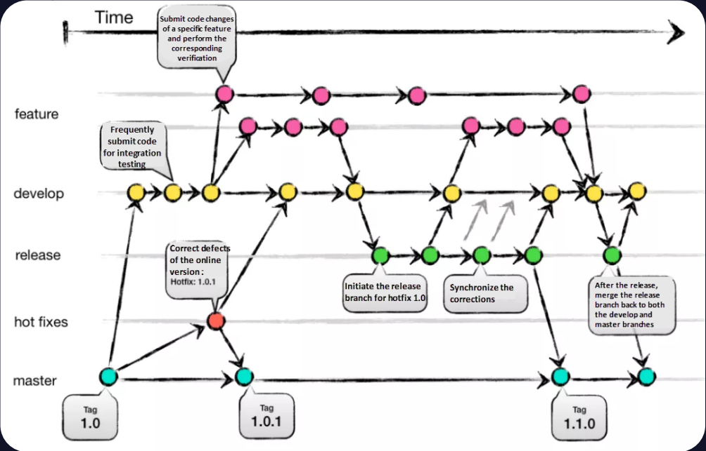

## WIL4

### 브랜치 관리의 필요성
- 서로의 작업에 영향을 주지 않기 위해 브랜치의 분리 필요
- 각 브랜치가 어떤 작업을 위해 존재하는지 구분 필요
- main 브랜치의 안전한 관리 필요

### 브랜치 보호 규칙
- 승인 없이 Pull request를 병합할 수 없도록 제한 가능
- 특정 브랜치에서 Push 가능자를 제한 가능

### 브랜치 전략
- Git Flow vs. GitHub Flow

### Git Flow
- 2010년에 Vincent Driessen이 고안한 방법
- 브랜치를 관리하기 위한 전략

#### 브랜치 종류
- Main Branches
    - main(master)
    - develop
- Supporting Branches
    - feature
    - release
    - hotfix

#### main(master)
- 프로젝트 생성 시 기본으로 생성되는 브랜치
- 영원히 존재하는 첫 번째 브랜치
- 병합될 때마다 제품의 새로운 버전이 탄생
- main이라는 이름 대신 master를 사용하기도 함

#### develop
- 영원히 존재하는 두 번째 브랜치
- feature 브랜치의 기반이 됨

#### feature
-  develop 브랜치에서 분기하여 작업
-  기능 개발 완료 후 다시 develop으로 병합
-  대부분의 이름 가능
    - 단, main, master, develop, release, hotfix 제외

#### release
- 배포 준비를 위한 브랜치
- 자잘한 버그를 수정하고 QA 작업을 함
- develop 브랜치에서 분기하여 main 브랜치로 병합

#### hotfix
- 배포 환경에서 즉각적인 수정이 필요할 경우 사용
- main 브랜치에서 분기
- main, develop 모두에 병합 필요

#### Git Flow


### GitHub Flow
- 수시로 배포되는 상황이 Git Flow와 안 어울리는 것을 개선하기 위해 고안한 방법

#### 브랜치 종류
- main과 feature 브랜치만 사용

#### main
- 항상 배포 가능 상태로 유지
- main으로 병합하기 전에 충분한 test필요

#### feature
- Git Flow와 달리 이외 브랜치들을 구분하지 않음
- main에서 분기하여 작업 후 다시 main으로 병합
- 브랜치의 목적을 이름에 잘 담아야 함
- Git Flow에 비해 코드 리뷰가 더 중요함

#### GitHub Flow


### Attitude

#### convention을 만들어 사용하자
- 긴 시간이 지난 후에도 ```convention``` 덕에 쉽게 의도를 파악할 수 있다.
    - 보기 좋은 프로젝트가 되는 건 덤

#### 구글링을 꼼꼼히 하자
- 알 것 같은 사람을 붙잡고 물어보는 것은 쉽지만, 금방 휘발된다.
- 직접 찾아보고 진짜 모르겠을 때만 주변 사람들에게 도움을 요청하자!

#### 코드에 대한 주인 의식을 가지자
- public repository에 있는 코드는 곧 내 얼굴이다.
- 돌아가기만 하는 코드보다는 잘 설계된 코드를 짜도록 노력하자.

#### 질문을 잘 하자
- 결국 누군가에게 질문을 해야하는 순간이 온다.
- ```좋은 질문```을 할 수 있도록 노력하자.